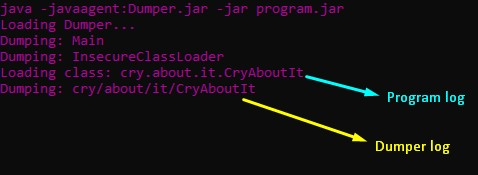
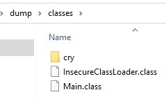
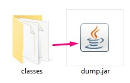

#Dump every class which in running in the JVM.

This tool can be used for dumping classes dynamically loaded
using some kind of ClassLoader. (Malware, Minecraft Clients)

##Usage:

**With a normal Java Application use:** 
_java -javaagent:Dumper.jar -jar program.jar_ 
  

**With a Minecraft Client use:** 
_add -javaagent:Dumper.jar to Launcher Arguments_ 
  

**After dumping you will have a folder with the classes.**
  

**You can convert the folder with classes into a .jar file using the Dumper as normal java application. **
  